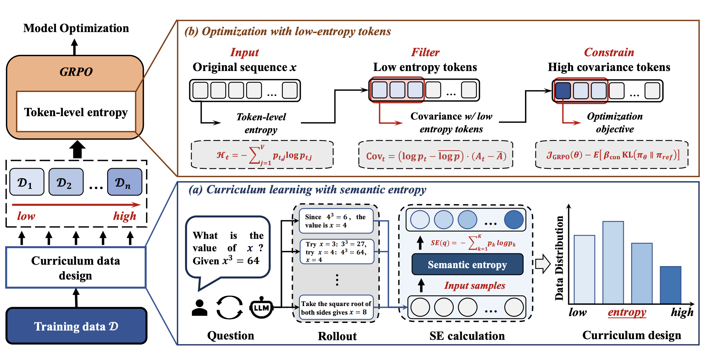
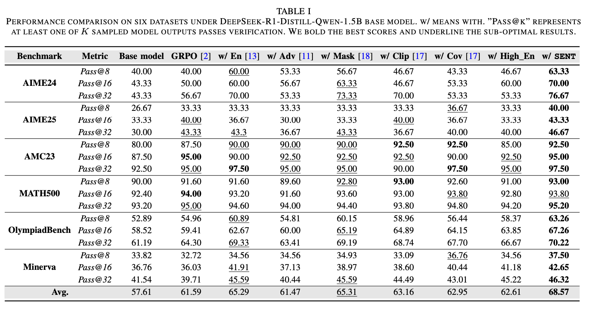
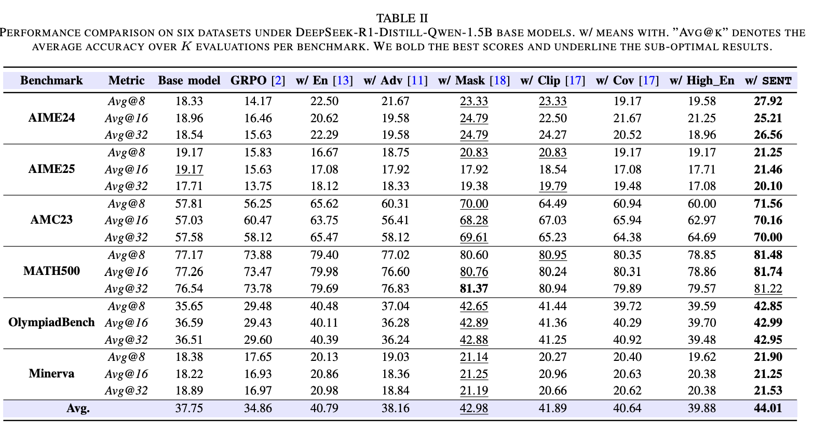

## Efficient Reinforcement Learning with Semantic and Token Entropy for LLM Reasoning  

This is the official repository containing the training and evaluation code for **SENT**.

## 💥 News 

- **[2025.12.04]** Our paper is now accessible at [arxiv](https://arxiv.org/pdf/2512.04359).

## 👀 About SENT

<p align="center">
     <br>
</p>


We present **SENT**, a dual-level exploration-aware framework designed to improve large language models’ reasoning capabilities by preventing entropy collapse during training. SENT jointly optimizes data organization and algorithmic regularization, enabling stable and sustained reasoning improvement.

## 🔥 Quick Start

1️⃣  Set up environment

Please follow the environment setup instructions provided in  
[VERL Installation Guide](https://verl.readthedocs.io/en/latest/start/install.html).


2️⃣  Download checkpoint

| Model | Repo ID |
|------|--------|
| 1.5B | deepseek-ai/DeepSeek-R1-Distill-Qwen-1.5B |
| 7B | Qwen/Qwen2.5-Math-7B |
| 14B | Qwen/Qwen3-14B |

Download a model by:
```bash
from huggingface_hub import snapshot_download

save_dir = ""
repo_id = ""
cache_dir = ""

snapshot_download(cache_dir=cache_dir,
  local_dir=save_dir,
  repo_id=repo_id,
  local_dir_use_symlinks=False,
  resume_download=True,
  allow_patterns=["*.json", "*.safetensors", "*.bin", "*.py", "*.md", "*.txt"],
)

```

## 🔥 Train & Eval
### Train
After preparing the environment and downloading the base model, run:

```bash
bash SENT/examples/grpo_curriculum/run_low_entropy_kl_cov_v2_curr_stage1.sh
bash SENT/examples/grpo_curriculum/run_low_entropy_kl_cov_v2_curr_stage2.sh
```

### Eval
Evaluation is conducted using the OpenCompass framework with vLLM acceleration.
| Benchmark | config_id |
|------|--------|
| AIME2024 | aime2024 |
| AIME2025 | aime2025 |
| AMC23 | amc23 |
| MATH500 | math_500_gen |
| OlympiadBench | olympiadbench |
| MINERVA | minerva |

```bash
cd eval
CUDA_VISIBLE_DEVICES=0 python run.py \
  --datasets <config_id> \
  --hf-type chat \
  --hf-path <PATH_TO_MODEL> \
  --dump-eval-details \
  --accelerator vllm
```

## 📊 Benchmarks

<p align="center">
     <br>
</p>

<p align="center">
     <br>
</p>

## 🤗 Acknowledgement

This repository is built upon the
[VERL](https://github.com/volcengine/verl) reinforcement learning framework and
[OpenCompass](https://github.com/open-compass/opencompass) evaluation platform.  
We thank the authors for their valuable contributions to the community.

## ✍️ Citation

```bibtex
@article{cao2025efficient,
  title={Efficient Reinforcement Learning with Semantic and Token Entropy for LLM Reasoning},
  author={Cao, Hongye and Bai, Zhixin and Peng, Ziyue and Wang, Boyan and Yang, Tianpei and Huo, Jing and Zhang, Yuyao and Gao, Yang},
  journal={arXiv preprint arXiv:2512.04359},
  year={2025}
}
```